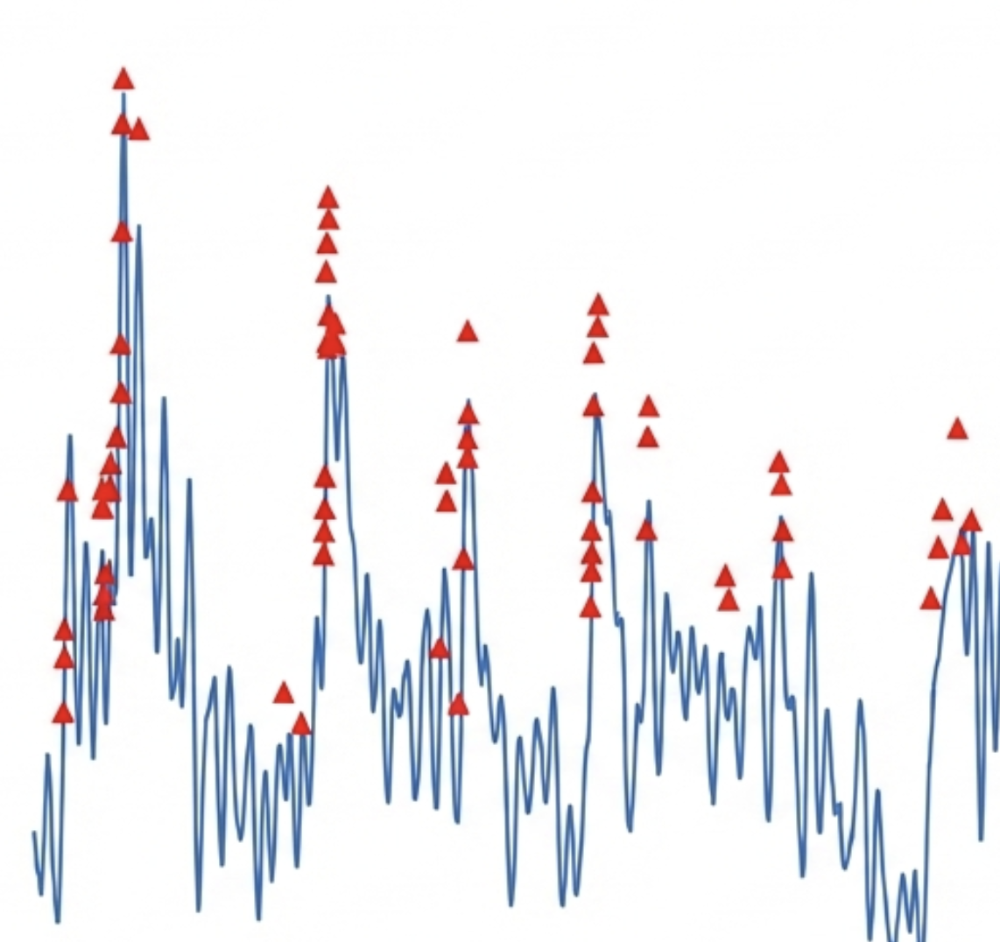

<p align="center">
  
</p>

<h1 align="center">CaImagingAnalysisFr</h1>

<p align="center">
  <strong>Complete calcium imaging analysis in R</strong><br>
  <em>From raw pixels to publication-ready figures</em>
</p>

<p align="center">
  <a href="https://codecov.io/gh/kevinj24fr/CaImagingAnalysisFr"></a>
  <a href="https://kevinj24fr.github.io/CaImagingAnalysisFr/"></a>
</p>

---

<br>

<table>
<tr>
<td width="50%">

### The Problem

Calcium imaging analysis is fragmented across Python tools, MATLAB scripts, and scattered R packages. Each step requires different software, file formats, and expertise.

</td>
<td width="50%">

### The Solution

One R package. One workflow. Every analysis step from motion correction to publication figures, unified in a Seurat-style interface.

</td>
</tr>
</table>

<br>

---

## Install

```r
remotes::install_github("kevinj24fr/CaImagingAnalysisFr")
```

---

## One Object. Complete Analysis.

```r
library(CaImagingAnalysisFr)

experiment <- CaExperiment(traces, frame_rate = 30) |>
  RunCorrection() |>
  RunSpikes() |>
  RunPCA() |>
  RunConnectivity() |>
  RunAssemblies()

# Everything stored, everything tracked
GetSpikes(experiment)
GetGraph(experiment, "connectivity")
ExportCommands(experiment, "pipeline.R")
```

---

<br>

<h2 align="center">Capabilities</h2>

<br>

<table>
<tr>
<td align="center" width="25%">
<h3>Signal</h3>
<p>Motion correction<br>Neuropil subtraction<br>Spike inference<br>Transient detection</p>
</td>
<td align="center" width="25%">
<h3>Network</h3>
<p>Functional connectivity<br>Graph metrics<br>Community detection<br>Information flow</p>
</td>
<td align="center" width="25%">
<h3>Population</h3>
<p>GPFA trajectories<br>Demixed PCA<br>Neural assemblies<br>Sequence replay</p>
</td>
<td align="center" width="25%">
<h3>Publication</h3>
<p>Cell/Nature themes<br>Raster plots<br>Tuning curves<br>Network diagrams</p>
</td>
</tr>
</table>

<br>

---

<h2 align="center">Advanced Methods</h2>

<br>

<p align="center">
<code>RunHMM</code> · <code>RunSLDS</code> · <code>RunTensorDecomp</code> · <code>RunChangepoints</code> · <code>RunTDA</code><br>
<code>RunRQA</code> · <code>RunCausalDiscovery</code> · <code>RunNeuralODE</code> · <code>RunGPSmooth</code> · <code>RunOTCompare</code>
</p>

<br>

---

## Performance

Built for real-world data sizes with native R performance optimizations.

| Feature | Technology |
|---------|------------|
| Type safety | S7 classes |
| Fast operations | data.table |
| Parallelization | future/furrr |
| Large datasets | Arrow/DuckDB |
| Acceleration | Rcpp |

---

## Learn More

<p align="center">
<a href="https://kevinj24fr.github.io/CaImagingAnalysisFr/">Documentation</a> ·
<a href="https://kevinj24fr.github.io/CaImagingAnalysisFr/reference/">Function Reference</a> ·
<a href="https://kevinj24fr.github.io/CaImagingAnalysisFr/news/">Changelog</a>
</p>

---

<br>

<p align="center">
<sub>MIT License · R ≥ 4.1.0 · <a href="https://github.com/kevinj24fr/CaImagingAnalysisFr/issues">Report Issues</a></sub>
</p>
